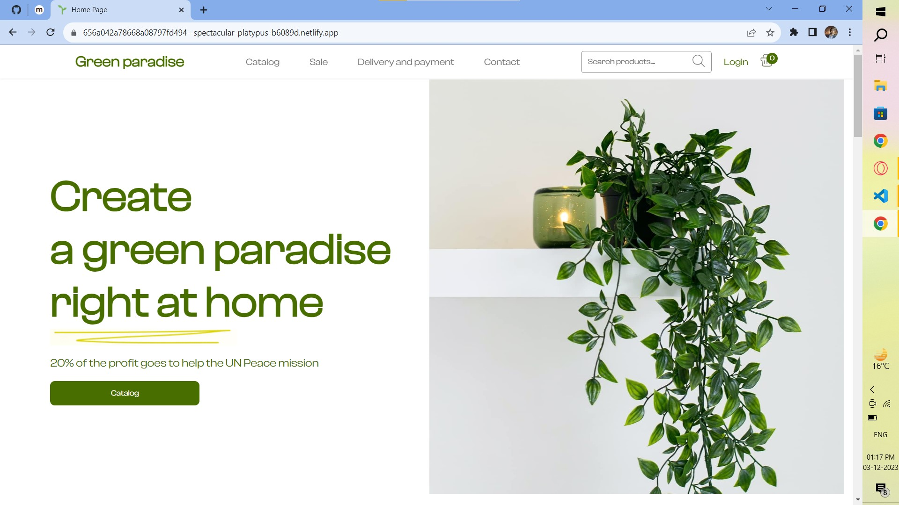

# Green Paradise - A Breath of Fresh Air

## Table of Contents

1. [Description](#description)
2. [Demo](#demo)
3. [Features](#features)
4. [Screenshots](#screenshots)
5. [Contributors](#authors)

## Description

Green Paradise is a fully functional e-commerce website designed for plant enthusiasts. It offers a wide variety of plants and gardening supplies, making it easy for users to browse, select, and purchase their favorite plants online. This project is built using HTML, CSS, and JavaScript to create an engaging and user-friendly online shopping experience for plant lovers.

## Demo

- [Live Demo](https://656a042a78668a08797fd494--spectacular-platypus-b6089d.netlify.app/)
## Features

- Browse and search for a wide range of plants.
- View detailed plant descriptions, including care instructions.
- Search Products right from the Navbar
- Add plants to the shopping cart.
- Calculate and display the total order price.
- Complete the purchase with secure checkout.
- User account creation and login.
- Responsive design for mobile and desktop users.

## Screenshots
 LANDING PAGE

 
 
 CATALOG PAGE
 
 
 
 PRODUCT DETAIL PAGE
 
 
 
 CHECKOUT PAGE
 
 

## Contributors
- Divyam Singh Rauthan : [Github](https://github.com/DivYam062)
- Madhukar Kumar: [Github](https://github.com/madhukarkr2468)
- Pankaj Khatri : [Github](https://github.com/MrPK4699)
